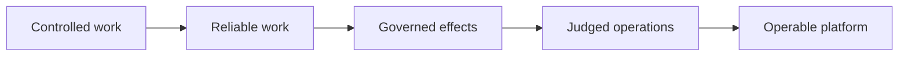
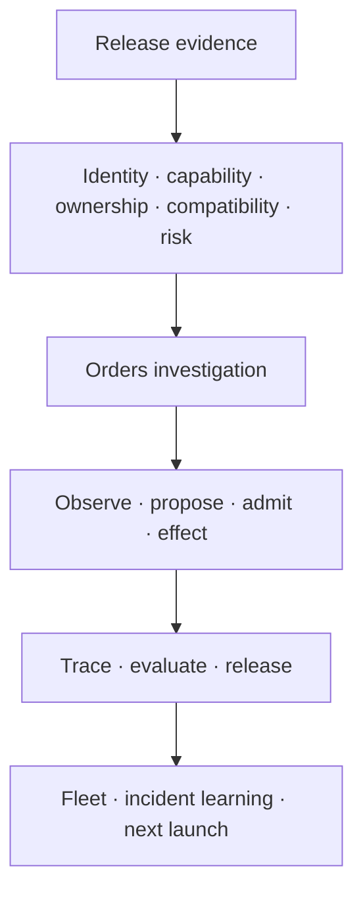

# From Answer to Operable Agent

*Mira's 37-chapter engineering journey*

Mira begins with an incident in the Orders service and a model that can produce a
useful answer. Across 37 executable checkpoints, she turns that answer into work
the organization can admit, observe, evaluate, operate, and refuse.

> **Animated guide:** [open the single-screen journey](https://htmlpreview.github.io/?https://github.com/topcoder-04/engineering-agentic-ai-companion/blob/main/docs/miras-journey.html).
> It begins automatically at Chapter 1. You can also
> [download the self-contained HTML](miras-journey.html?raw=1) and open it
> locally for the same experience offline.

The journey is cumulative. Every chapter branch is the complete system as it
exists at that point, not an isolated sample.

## Controlled Work

Mira first separates model judgment from deterministic execution and gives the
investigation a resumable shape.

| Chapter | What changes in the investigation | Checkpoint |
|---:|---|---|
| 1 | A useful answer is separated from completed work. | [`chapter-01`](https://github.com/topcoder-04/engineering-agentic-ai-companion/tree/chapter-01) |
| 2 | The investigation receives an explicit boundary around what it may touch. | [`chapter-02`](https://github.com/topcoder-04/engineering-agentic-ai-companion/tree/chapter-02) |
| 3 | The model may propose; deterministic code decides what may execute. | [`chapter-03`](https://github.com/topcoder-04/engineering-agentic-ai-companion/tree/chapter-03) |
| 4 | Recorded evidence can create the next bounded task. | [`chapter-04`](https://github.com/topcoder-04/engineering-agentic-ai-companion/tree/chapter-04) |
| 5 | Model proposals must cross a typed admission contract. | [`chapter-05`](https://github.com/topcoder-04/engineering-agentic-ai-companion/tree/chapter-05) |
| 6 | Variable judgment receives an explicit budget. | [`chapter-06`](https://github.com/topcoder-04/engineering-agentic-ai-companion/tree/chapter-06) |
| 7 | The controlled workflow can persist, stop, and resume. | [`chapter-07`](https://github.com/topcoder-04/engineering-agentic-ai-companion/tree/chapter-07) |

## Reliable Work

The workflow now survives retries, uncertainty, limited memory, unsafe dependency
content, and generated execution.

| Chapter | What changes in the investigation | Checkpoint |
|---:|---|---|
| 8 | Retrying cannot duplicate an effect. | [`chapter-08`](https://github.com/topcoder-04/engineering-agentic-ai-companion/tree/chapter-08) |
| 9 | An unknown effect outcome is reconciled before another attempt. | [`chapter-09`](https://github.com/topcoder-04/engineering-agentic-ai-companion/tree/chapter-09) |
| 10 | Memory retrieval is relevant, ranked, and bounded. | [`chapter-10`](https://github.com/topcoder-04/engineering-agentic-ai-companion/tree/chapter-10) |
| 11 | An explicit task spine prevents interesting evidence from replacing the mission. | [`chapter-11`](https://github.com/topcoder-04/engineering-agentic-ai-companion/tree/chapter-11) |
| 12 | Delegated work remains attached to an owner and purpose. | [`chapter-12`](https://github.com/topcoder-04/engineering-agentic-ai-companion/tree/chapter-12) |
| 13 | Dependency evidence is typed; instruction-bearing content is quarantined. | [`chapter-13`](https://github.com/topcoder-04/engineering-agentic-ai-companion/tree/chapter-13) |
| 14 | Generated work executes inside an explicit sandbox. | [`chapter-14`](https://github.com/topcoder-04/engineering-agentic-ai-companion/tree/chapter-14) |

## Governed Effects

Mira makes consequence, approval, authority, and policy part of the executable
path. By Chapter 21, policy is enforced where the report is actually written.

| Chapter | What changes in the investigation | Checkpoint |
|---:|---|---|
| 15 | Higher-consequence decisions require stronger judgment. | [`chapter-15`](https://github.com/topcoder-04/engineering-agentic-ai-companion/tree/chapter-15) |
| 16 | New evidence may change the next useful action. | [`chapter-16`](https://github.com/topcoder-04/engineering-agentic-ai-companion/tree/chapter-16) |
| 17 | Parallel contributions merge without becoming false completion. | [`chapter-17`](https://github.com/topcoder-04/engineering-agentic-ai-companion/tree/chapter-17) |
| 18 | Consequential approval can wait safely and resume deliberately. | [`chapter-18`](https://github.com/topcoder-04/engineering-agentic-ai-companion/tree/chapter-18) |
| 19 | Authority is bound to explicit capabilities. | [`chapter-19`](https://github.com/topcoder-04/engineering-agentic-ai-companion/tree/chapter-19) |
| 20 | Policy is expressed independently of model wording. | [`chapter-20`](https://github.com/topcoder-04/engineering-agentic-ai-companion/tree/chapter-20) |
| 21 | The effect boundary enforces policy before writing the report. | [`chapter-21`](https://github.com/topcoder-04/engineering-agentic-ai-companion/tree/chapter-21) |

## Judged Operations

The same investigation path becomes traceable, evaluable, releasable, observable,
stress-tested, learnable, and fleet-aware.

| Chapter | What changes in the investigation | Checkpoint |
|---:|---|---|
| 22 | Traces record the path and its refusals, not only the answer. | [`chapter-22`](https://github.com/topcoder-04/engineering-agentic-ai-companion/tree/chapter-22) |
| 23 | Evaluation judges the complete trajectory. | [`chapter-23`](https://github.com/topcoder-04/engineering-agentic-ai-companion/tree/chapter-23) |
| 24 | Failed evaluation blocks release. | [`chapter-24`](https://github.com/topcoder-04/engineering-agentic-ai-companion/tree/chapter-24) |
| 25 | Production can be observed without exposing sensitive content. | [`chapter-25`](https://github.com/topcoder-04/engineering-agentic-ai-companion/tree/chapter-25) |
| 26 | Variation tests explore cases authored examples miss. | [`chapter-26`](https://github.com/topcoder-04/engineering-agentic-ai-companion/tree/chapter-26) |
| 27 | An incident becomes an executable regression boundary. | [`chapter-27`](https://github.com/topcoder-04/engineering-agentic-ai-companion/tree/chapter-27) |
| 28 | Fleet routing admits only released candidates within shared limits. | [`chapter-28`](https://github.com/topcoder-04/engineering-agentic-ai-companion/tree/chapter-28) |

## Operable Platform

The platform does not float beside the agent. Identity, capability, delegated
authority, placement, conformance, ownership, compatibility, and risk all gate
the same Orders investigation.

| Chapter | What changes in the investigation | Checkpoint |
|---:|---|---|
| 29 | Only a registered workload identity may run. | [`chapter-29`](https://github.com/topcoder-04/engineering-agentic-ai-companion/tree/chapter-29) |
| 30 | The platform admits declared capabilities instead of copied settings. | [`chapter-30`](https://github.com/topcoder-04/engineering-agentic-ai-companion/tree/chapter-30) |
| 31 | Delegation carries the caller's authority without creating a confused deputy. | [`chapter-31`](https://github.com/topcoder-04/engineering-agentic-ai-companion/tree/chapter-31) |
| 32 | Data placement keeps tenant evidence inside its allowed boundary. | [`chapter-32`](https://github.com/topcoder-04/engineering-agentic-ai-companion/tree/chapter-32) |
| 33 | The paved scaffold makes the admitted path the easiest path. | [`chapter-33`](https://github.com/topcoder-04/engineering-agentic-ai-companion/tree/chapter-33) |
| 34 | A conformance receipt is bound to the exact released artifact. | [`chapter-34`](https://github.com/topcoder-04/engineering-agentic-ai-companion/tree/chapter-34) |
| 35 | Operator, runbook, and rollback ownership remain present after launch. | [`chapter-35`](https://github.com/topcoder-04/engineering-agentic-ai-companion/tree/chapter-35) |
| 36 | Compatibility windows let platform contracts evolve deliberately. | [`chapter-36`](https://github.com/topcoder-04/engineering-agentic-ai-companion/tree/chapter-36) |
| 37 | Launch risk is derived from real evidence and becomes the final executable veto. | [`chapter-37`](https://github.com/topcoder-04/engineering-agentic-ai-companion/tree/chapter-37) |

## The final shape

At Chapter 37, `approve_launch(...)` receives evidence produced by the preceding
layers. If stale variations, missing ownership, invalid authority, unsafe data
placement, or incompatible contracts remain, the investigation does not launch.

[Run the complete checkpoint](https://github.com/topcoder-04/engineering-agentic-ai-companion/tree/main#start-here)
or return to the [repository overview](../README.md).
